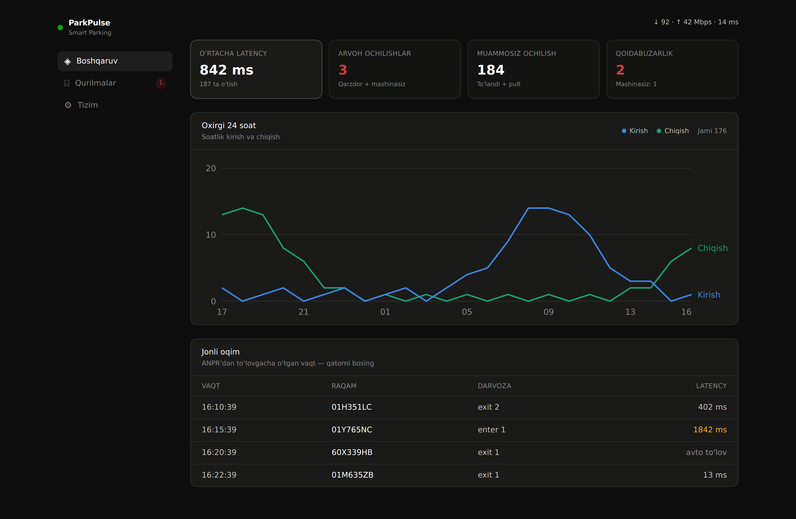
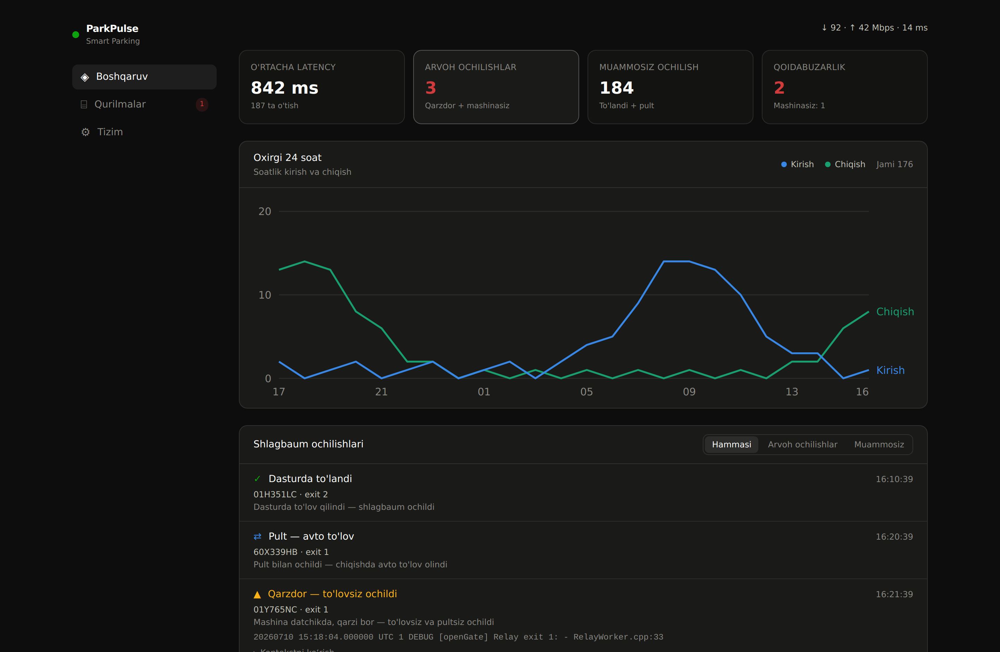
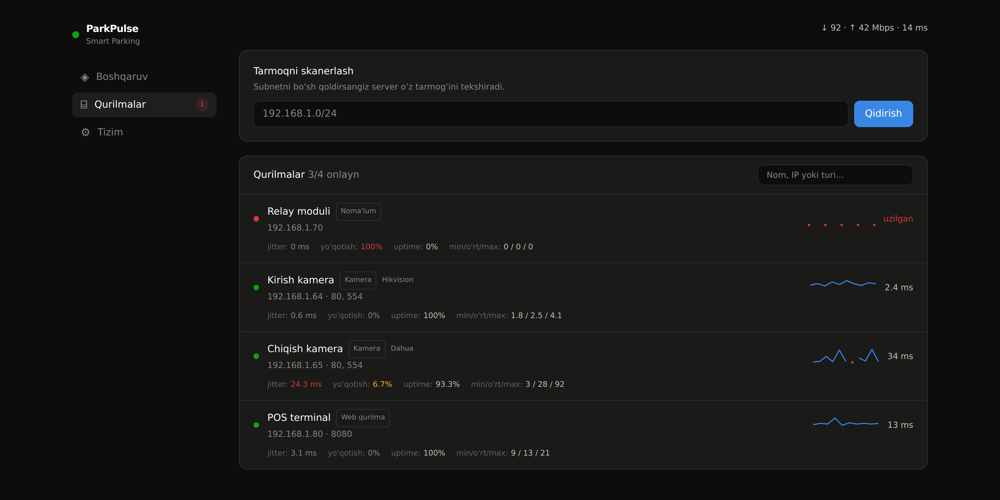

# ParkPulse

Real-time monitoring for barrier-gate parking systems. ParkPulse tails the
parking controller's Docker logs, reconstructs each car's ANPR → payment →
barrier-open chain, and surfaces two things operators actually care about:

- **How fast** the system reacts (ANPR-to-payment latency, broken down per stage).
- **Why the barrier opened** — classified into four states, so a genuine
  "ghost opening" is never confused with a normal paid exit or a network hiccup.

It also monitors the LAN devices around the gate (cameras, relays, POS
terminals) with ping quality metrics, watches server/container health, and
exposes everything over WebSocket to a single-page dashboard and over a
Prometheus `/metrics` endpoint.

It ships as **one Docker image** (Go backend + embedded Next.js static UI) and
touches only the log stream — it never connects to the parking database.



<details>
<summary>More screenshots</summary>

**Opening history — four states, only the anomalies are logged**



**Network devices — ping quality (jitter, loss, uptime) with sparklines**



</details>

## Why

On a barrier gate, "the barrier opened" and "a car paid and left" are not the
same event, and conflating them hides real problems. ParkPulse separates every
opening into four states:

| State | Meaning | Counted as ghost? | Logged? |
|-------|---------|-------------------|---------|
| **Paid** | Payment went through in software, then the barrier opened. | No | No |
| **Remote** | Car on the sensor, guard opened with the remote; the system auto-charged on exit. | No | No |
| **Violation** | Car on the sensor with an outstanding debt — opened with no payment and no remote. | **Yes** | Yes (+ log context) |
| **Ghost** | No car on the sensor at all, yet the barrier opened by itself. | **Yes** | Yes (+ log context) |
| **Entry** | Car entered an `enter` gate (no payment expected). | No | No |

Only **Violation** and **Ghost** are real anomalies. They increment the ghost
counter and are saved with the surrounding log lines as evidence; the harmless
states appear in the feed but write no log. Crucially, a `Connection is closed`
line from the relay hardware is treated as noise, **not** an opening — this is
the single most common source of false ghost alerts.

## Features

- **Latency tracing** — ANPR → Gateway → DB → POS chain with a per-stage
  breakdown. Remote/auto-pay openings are flagged and excluded from the average
  so a driver's dwell time never inflates the KPI.
- **Four-state opening classifier** (see above).
- **Adaptive log reading** — no fixed vendor format required. Gate keywords are
  multilingual/configurable, and a correlation detector *learns* which log line
  means "barrier opened" by watching what consistently follows a payment — so it
  works on installations whose wording differs, with no regex edits and no AI.
- **Live log inspector** — see each log line with the label ParkPulse gave it
  (ANPR / POS / OPEN / …), so mismatches are obvious at a glance.
- **24-hour traffic chart** — hourly entries vs. exits.
- **Network device monitoring** — subnet scan, device fingerprinting
  (camera/web/unknown + vendor), and per-device **ping quality**: jitter, packet
  loss, uptime %, min/avg/max, and a live RTT sparkline. Works even for devices
  that block ICMP (TCP fallback).
- **Server & container health** — CPU per core, RAM, uptime, and `docker stats`
  per container.
- **SNMP switch/router monitoring** — poll interface status (up/down) and
  live throughput (in/out Mbps) from managed switches and routers.
- **Alerting** — Telegram and/or webhook notifications on device down, ghost
  opening, or SNMP port down. Works without Grafana; fires only on state change.
- **Internet speedtest** — periodic download/upload/ping via Cloudflare.
- **Prometheus `/metrics`** — plug straight into Grafana.
- **YAML config** — declarative, git-friendly alternative to env vars.

## Quick start

```bash
docker run -d --name parkpulse \
  -e TARGET_CONTAINER=p24gui \
  -v /var/run/docker.sock:/var/run/docker.sock \
  --network host \
  ghcr.io/jamolovmn/parking-pulse:latest
```

Then open `http://localhost:8888`.

- `TARGET_CONTAINER` — the container whose logs to read (comma-separated for
  several). **Optional** — you can also pick the container(s) live from the
  dashboard (**Tizim → Kuzatiladigan konteyner**); the choice is saved
  (`TARGET_STORE`, default `target.json`) and applied without a restart.
- The Docker socket mount lets ParkPulse list containers, tail logs, and read
  `docker stats`.
- `--network host` is what makes LAN device scanning and pinging work.

### Build it yourself

```bash
./build.sh --local   # build the image locally (no push)
```

The [Dockerfile](Dockerfile) builds the Next.js UI to static files and the Go
binary, then ships a ~29 MB Alpine image.

## Configuration

Every setting is an environment variable, and **explicit env always wins**. A
YAML file is an optional convenience — see [`parkpulse.example.yaml`](parkpulse.example.yaml).
Copy it to `parkpulse.yaml` (working dir), or `/etc/parkpulse/config.yaml`, or
point `CONFIG_FILE` at it.

| Env | Default | Purpose |
|-----|---------|---------|
| `TARGET_CONTAINER` | — | Container name(s) to tail, comma-separated. Optional — can also be chosen from the dashboard. |
| `LISTEN_ADDR` | `:8888` | HTTP/WebSocket listen address. |
| `DEVICES` | — | Monitored devices: `name=ip,name=ip`. |
| `SCAN_SUBNET` | auto | Subnet(s) for the scanner, e.g. `192.168.1.0/24`. |
| `SPEEDTEST_MIN` | `15` | Speedtest interval in minutes (`0` disables). |
| `MATCH_WINDOW_SEC` | `180` | ANPR→payment correlation window. |
| `AUTOPAY_SEC` | `90` | How long to wait for auto-payment after an opening (remote vs. violation). |
| `PRESENCE_SEC` | `60` | How long an ANPR read counts as "car on the sensor". |
| `RELAY_OPEN_RE` | built-in | Regex for the physical barrier-open log line. |
| `RELAY_REMOTE_RE` | built-in | Regex for the guard's remote-open signal. |
| `GATE_ENTER_WORDS` | `enter,entry,kirish,in` | Words that mean an entry lane (comma-separated, any language). |
| `GATE_EXIT_WORDS` | `exit,chiqish,out` | Words that mean an exit lane. |
| `OPEN_LEARN_WINDOW_SEC` | `8` | Max gap after a payment for a log line to count as the "open" line. |
| `OPEN_LEARN_MIN` | `5` | How many correlated occurrences before an "open" template is trusted. |
| `OPEN_LEARN_RATIO` | `0.6` | Fraction of a template's occurrences that must follow a payment. |
| `SNMP_TARGETS` | — | SNMP devices: `name=ip@community`, comma-separated. Add `#1` for SNMP v1. |
| `SNMP_INTERVAL_SEC` | `30` | SNMP poll interval. |
| `ALERT_TELEGRAM_TOKEN` | — | Telegram bot token (from @BotFather). |
| `ALERT_TELEGRAM_CHAT` | — | Telegram chat/channel id to send alerts to. |
| `ALERT_WEBHOOK_URL` | — | Optional URL to POST a JSON alert payload to. |

The two regexes let you adapt ParkPulse to a controller whose log wording
differs, without rebuilding.

## Adaptive log reading

Different controllers/sites word their logs differently, so a single fixed regex
misses events on some installations. ParkPulse handles this **deterministically —
no AI, fully offline** — in three layers:

1. **Multilingual gate words.** Entry/exit are matched from a configurable word
   list (`GATE_ENTER_WORDS` / `GATE_EXIT_WORDS`) — `exit 1`, `chiqish 1`, `out 3`
   all normalize to the same canonical gate.
2. **Correlation learning.** Each unmatched line is reduced to a *template*
   (numbers and plates → `#`). The template that consistently appears within a
   few seconds **after a payment** is learned to be the "barrier opened" line —
   ParkPulse then treats it as an open event even though no regex matched it.
3. **Direction from behaviour, not words.** A learned open that follows a payment
   is an **exit**; one that follows only a plate read (no payment) is an
   **entry**. So the entry/exit split is inferred from what actually happened.

Watch it work in the **Loglar (Logs)** tab: every line shows the label ParkPulse
gave it, `OPEN∗` marks an auto-detected open, and a banner shows the learned
template. Nothing is sent anywhere — the learning happens in-process.

## Alerting

ParkPulse can push a notification the moment something goes wrong — no Grafana
required. Alerts fire **only on a state change** (a device going down, then a
separate alert when it recovers), so a flapping link doesn't spam you.

Triggers:

- **Device down / recovered** — a **watched** device stops (or resumes)
  responding. Only devices you star (★) in the **Qurilmalar (Devices)** tab
  alert, so transient hosts like phones and laptops that come and go on the LAN
  never page you. Devices listed in `DEVICES` are watched by default; auto-scanned
  ones are not. You can also **rename any device** (✎) so it's unmistakable
  (e.g. relabel an "unknown device" as "Relay"). Both are saved (`DEVICES_STORE`,
  default `devices.json`).
- **Ghost / violation opening** — a suspicious barrier opening (the same events
  that increment the ghost counter).
- **SNMP port down / up** — a switch interface changes state.

**Configure it from the dashboard** — no rebuild needed. Open **Tizim
(System) → Ogohlantirish**, paste your Telegram bot token + chat id (and/or a
webhook URL), **Save**, then **Send test** to confirm it works. Settings are
written to a JSON file (`ALERT_STORE`, default `alerts.json`) and survive a
restart; mount it on a volume to survive a re-pull.

- **Telegram** — create a bot with [@BotFather](https://t.me/BotFather) to get
  the token; the chat id is your channel/group id (or personal chat id).
- **Webhook** — ParkPulse POSTs a JSON body `{level, title, text, time}` to the
  URL (route it to Slack, a script, anything).

Prefer config-as-code? The same values can be set via env
(`ALERT_TELEGRAM_TOKEN`, `ALERT_TELEGRAM_CHAT`, `ALERT_WEBHOOK_URL`) or the
`alerts:` block in YAML. A value saved from the UI takes precedence over env on
the next restart.

## SNMP (switch / router monitoring)

Point ParkPulse at managed switches or routers and it polls each interface for
**operational status** (up/down) and **live throughput** (in/out Mbps, derived
from the interface octet counters). A **Network** tab appears in the dashboard,
and the data is also exported to Prometheus.

```bash
-e SNMP_TARGETS="Core=192.168.1.1@public,Edge=192.168.1.2@public"
```

Format is `name=ip@community`, comma-separated. Append `#1` for SNMP v1
(`...@public#1`); the default is v2c. Throughput needs two polls to appear, so
the first interval shows only status. Requires SNMP to be enabled on the device
(read-only community is enough).

## Grafana / Prometheus

### How the pieces fit (read this first)

There are three separate programs, and they connect in a chain:

```
ParkPulse (/metrics)  ──►  Prometheus  ──►  Grafana
   raw numbers,             stores them        draws
   "right now"              over time          graphs
```

**ParkPulse does not appear in any "apps" or "integrations" list inside Grafana
or Prometheus.** You do not register it anywhere. It simply publishes a plain
text page at `http://<host>:8888/metrics`. The connection happens by **editing
Prometheus's config file** to tell Prometheus that URL — that is the whole
"adding" step. Then Grafana connects to *Prometheus* (not to ParkPulse).

So the mental model is: *ParkPulse is the sensor, Prometheus is the recorder,
Grafana is the screen.* You wire the sensor to the recorder in a config file,
and you pick the recorder from Grafana's data-source list.

### Step by step

A ready-to-run setup lives in [`monitoring/`](monitoring/).

**1. Run Prometheus + Grafana.** From the repo:

```bash
docker compose -f monitoring/docker-compose.yml up -d
```

**2. Tell Prometheus where ParkPulse is.** Edit
[`monitoring/prometheus.yml`](monitoring/prometheus.yml) and set the target to
the host where ParkPulse runs:

```yaml
scrape_configs:
  - job_name: parkpulse
    static_configs:
      - targets: ["host.docker.internal:8888"]   # or the LAN IP, e.g. 192.168.1.50:8888
```

> **The #1 mistake:** do not write `localhost:8888` here. Prometheus runs in its
> own container, so `localhost` means *Prometheus itself*, not ParkPulse. Use
> `host.docker.internal:8888` (works on the provided compose) or the server's
> real LAN IP. Restart with `docker compose -f monitoring/docker-compose.yml restart prometheus`.

**3. Verify the connection.** Open `http://localhost:9090/targets`. The
`parkpulse` target must say **UP**. If it says DOWN, the target address is wrong
(see the mistake above) or ParkPulse isn't reachable from the Prometheus
container.

**4. Connect Grafana to Prometheus.** Open `http://localhost:3000`
(login `admin` / `admin`). Go to **Connections → Data sources → Add data
source**, and from the list **pick "Prometheus"** — *this is the step you were
looking for; you choose Prometheus here, ParkPulse is never in this list.* Set
the URL to `http://parkpulse-prometheus:9090` (the compose service name) and
click **Save & test**.

**5. Build panels.** **Dashboards → New → Add visualization**, choose the
Prometheus data source, and type a metric name into the query box. Examples:

| Panel | Query |
|-------|-------|
| Gate reaction time | `parkpulse_avg_latency_ms` |
| Ghost openings | `parkpulse_ghost_openings_total` |
| Openings by type | `parkpulse_opens_total` |
| Devices online | `parkpulse_device_up` |
| Camera latency / jitter | `parkpulse_device_rtt_ms` · `parkpulse_device_jitter_ms` |
| Packet loss | `parkpulse_device_loss_ratio` |
| Switch port up | `parkpulse_snmp_if_up` |
| Switch throughput | `parkpulse_snmp_if_in_mbps` · `parkpulse_snmp_if_out_mbps` |

**6. Alerting (optional).** In Grafana **Alerting → Alert rules**, create a rule
like `parkpulse_ghost_openings_total > 0` or `parkpulse_device_up == 0 for 2m`
and route it to Telegram, email, or a webhook — so the dashboard pages you
instead of you watching it.

### The metrics

`GET /metrics` in Prometheus text format, no exporter needed. Sample:

```
parkpulse_device_up{ip="192.168.1.64",name="Entrance cam"} 1
parkpulse_device_rtt_ms{ip="192.168.1.64",name="Entrance cam"} 2.4
parkpulse_device_jitter_ms{ip="192.168.1.64",name="Entrance cam"} 0.6
parkpulse_device_loss_ratio{ip="192.168.1.64",name="Entrance cam"} 0
parkpulse_passes_total 187
parkpulse_avg_latency_ms 842.3
parkpulse_ghost_openings_total 3
parkpulse_opens_total{kind="violation"} 2
parkpulse_cpu_percent{core="0"} 23.4
parkpulse_snmp_if_up{host="Core switch",if="Gi0/1"} 1
parkpulse_snmp_if_in_mbps{host="Core switch",if="Gi0/1"} 143.2
parkpulse_speedtest_download_mbps 92.4
```

## Architecture

```
Docker logs ─► collector ─► parser ─► analyzer ─┐
LAN devices ─► netmon (ping + quality) ─────────┤
switches ────► snmp (interface poll) ───────────├─► WebSocket hub ─► dashboard (Next.js)
server stats ─► collector.health ───────────────┤                └─► /metrics (Prometheus)
                                                └─► alert (Telegram / webhook)
```

- **parser** — regex-matches log lines into typed events (ANPR, Gateway,
  Permit, POS, Open, Remote).
- **analyzer** — assembles events into per-car sessions, computes latency, and
  classifies each opening into one of the states above.
- **netmon** — pings monitored devices, scans subnets, fingerprints device type
  and vendor, and derives ping-quality stats over a rolling window.
- **snmp** — polls managed switches/routers for interface status and throughput.
- **alert** — watches the event stream and pushes Telegram/webhook alerts on
  state changes (device down, ghost opening, port down).
- **ws** — fans out snapshots and live events to browsers; also renders
  `/metrics`.

## Development

```bash
# Backend
cd backend && go test ./...

# Frontend
cd frontend && npm install && npm run dev   # http://localhost:3000
```

The dev UI expects the backend WebSocket on the same host; run the backend with
`STATIC_DIR` pointing at `frontend/out` (after `npm run build`) to serve both
from one process, exactly as the Docker image does.

## License

MIT
