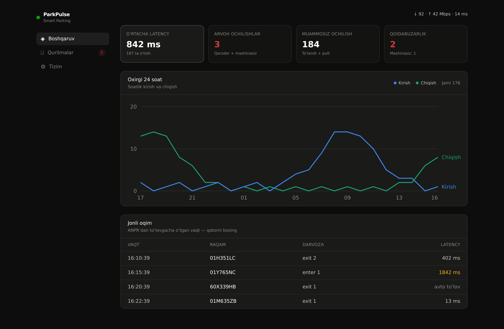
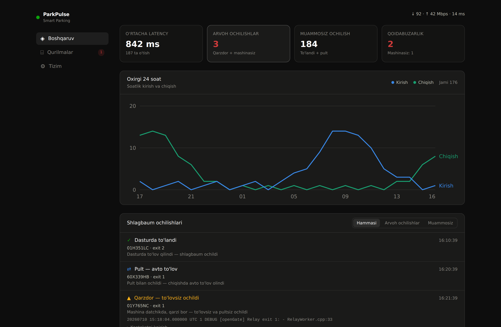
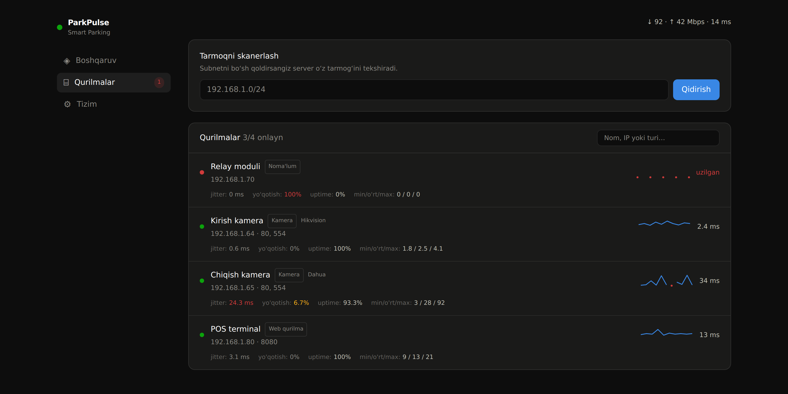

# ParkPulse

**Shlagbaumli parkovka tizimlari uchun real vaqt monitoringi.**
🇬🇧 English docs: [**README.md**](README.md)

[](LICENSE)
[](backend/go.mod)
[](frontend)
[](Dockerfile)
[](#grafana--prometheus)
[](https://github.com/jamolovmn/ParkPulse/stargazers)
[](https://github.com/jamolovmn/ParkPulse/commits/main)

ParkPulse parkovka kontrollerining Docker loglarini o'qiydi, har bir mashinaning
**ANPR → to'lov → shlagbaum ochilishi** zanjirini qayta tiklaydi va operatorga
eng muhim ikki narsani ko'rsatadi:

- **Tizim qanchalik tez ishlayapti** — ANPR'dan to'lovgacha o'tgan vaqt, har
  qadam bo'yicha ajratilgan.
- **Shlagbaum nega ochildi** — 4 holatga ajratilib, haqiqiy "arvoh ochilish"
  hech qachon oddiy to'langan chiqish yoki tarmoq uzilishi bilan aralashtirilmaydi.

Bundan tashqari, u shlagbaum atrofidagi tarmoq qurilmalarini (kameralar, relelar,
POS terminallar) ping sifati bilan kuzatadi, server/konteyner holatini nazorat
qiladi, hostni tekshirish uchun **AI agent** bilan ta'minlaydi va hamma narsani
WebSocket orqali bir sahifali panelga hamda Prometheus `/metrics` ga chiqaradi.

U **bitta Docker image** bo'lib keladi (Go backend + ichiga joylashtirilgan
Next.js UI) va faqat log oqimiga tegadi — parkovka bazasiga **hech qachon**
ulanmaydi.



<details>
<summary>Yana skrinshotlar</summary>

**Ochilishlar tarixi — 4 holat, faqat anomaliyalar loglanadi**



**Tarmoq qurilmalari — ping sifati (jitter, yo'qotish, uptime)**



</details>

---

## Mundarija

- [Nima qila oladi](#nima-qila-oladi) — har bir funksiya tushuntirilgan
- [Tez boshlash](#tez-boshlash) — bitta `docker run` bilan ishga tushirish
- [AI agent](#ai-agent) — host bilan suhbat
- [Sozlash](#sozlash) — barcha env o'zgaruvchilar
- [Adaptiv log o'qish](#adaptiv-log-oqish)
- [Ogohlantirishlar](#ogohlantirishlar)
- [SNMP monitoring](#snmp-switchrouter-monitoring)
- [Grafana / Prometheus](#grafana--prometheus)
- [Arxitektura](#arxitektura)

---

## Nima qila oladi

Har bir funksiya mustaqil — faqat kerakligini yoqing.

### 1. Latency (kechikish) kuzatuvi
Har bir chiqish zanjir sifatida qayta tiklanadi: **ANPR → Gateway → DB (permit)
→ POS (to'lov)**. ParkPulse ANPR'dan to'lovgacha bo'lgan umumiy vaqtni *va* har
qadam bo'yicha taqsimotni ko'rsatadi — shunda sekinlik kamerada, bazada yoki POS
terminalidami, aniq bilasiz. Pult/avto-to'lov ochilishlari (bunda haydovchining
turish vaqti raqamni buzib yuborardi) alohida belgilanadi va **o'rtachaga
qo'shilmaydi** — KPI halol qoladi. **Boshqaruv → Jonli oqim** bo'limida.

### 2. To'rt holatli ochilish klassifikatori
"Shlagbaum ochildi" va "mashina to'lab ketdi" — bir xil hodisa emas. Har bir
ochilish quyidagi holatlardan biriga ajratiladi:

| Holat | Ma'nosi | Anomaliyami? |
|-------|---------|--------------|
| **Paid (To'landi)** | Dasturda to'lov o'tdi, keyin shlagbaum ochildi. | Yo'q |
| **Remote (Pult)** | Qorovul pult bilan ochdi; chiqishda tizim avto pul yechdi. | Yo'q |
| **Entry (Kirish)** | Mashina `enter` darvozadan kirdi (to'lov kutilmaydi). | Yo'q |
| **Violation (Qoidabuzarlik)** | Datchikda mashina bor, qarzi bor — to'lovsiz, pultsiz ochildi. | **Ha** |
| **Ghost (Arvoh)** | Datchikda mashina umuman yo'q, lekin shlagbaum ochildi. | **Ha** |

Faqat **Qoidabuzarlik** va **Arvoh** hisoblagichni oshiradi va dalil sifatida
atrofdagi log qatorlari bilan saqlanadi. **Ochilishlar** panelida.

### 3. Adaptiv log o'qish (qat'iy format shart emas, AI'siz)
Har xil kontrollerlar loglarni har xil yozadi. ParkPulse buni deterministik va
to'liq oflayn hal qiladi — ko'p tilli darvoza so'zlari + korrelyatsiya
detektori "shlagbaum ochildi" degan qatorni to'lovdan keyin muntazam kelishiga
qarab **o'zi o'rganadi**. [Adaptiv log o'qish](#adaptiv-log-oqish)ga qarang.
Regex tahrirlash shart emas.

### 4. Jonli log inspektori
**Loglar** ko'rinishi har bir xom log qatorini ParkPulse bergan yorliq bilan
(ANPR / POS / OPEN / …) ko'rsatadi, avto-aniqlangan ochilishlarni `OPEN∗` bilan
belgilaydi — noto'g'ri tasnif darhol ko'rinadi.

### 5. 24 soatlik trafik grafigi
So'nggi 24 soatdagi soatlik **kirish va chiqish** soni, panelda.

### 6. Tarmoq qurilmalari monitoringi
Subnetni skanerlaydi, har qurilmani aniqlaydi (kamera / web / noma'lum, hamda
Hikvision, Dahua kabi ishlab chiqaruvchi) va har qurilma uchun **ping sifatini**
kuzatadi: jitter, paket yo'qotish, uptime %, min/o'rtacha/maks RTT va jonli RTT
grafigi. ICMP'ni bloklaydigan qurilmalar uchun ham ishlaydi (TCP zaxira).
Qurilmani yulduzcha (★) bilan belgilasangiz — uzilganda ogohlantiradi;
istalganini qayta nomlash (✎) mumkin. **Qurilmalar** bo'limida.

### 7. Server va konteyner holati
Har yadro bo'yicha CPU, RAM, uptime va har konteyner uchun `docker stats`
(CPU/RAM). **Tizim** bo'limida.

### 8. SNMP switch / router monitoringi
Boshqariladigan switch/routerlarning har interfeysi uchun **holat** (up/down) va
jonli **o'tkazuvchanlik** (kirish/chiqish Mbps) so'raladi. Sozlanganda **Tarmoq**
bo'limi paydo bo'ladi. [SNMP monitoring](#snmp-switchrouter-monitoring)ga qarang.

### 9. Ogohlantirishlar (Telegram / webhook)
Kuzatilayotgan qurilma uzilsa, arvoh/qoidabuzarlik ochilishi bo'lsa yoki SNMP
porti tushsa — darhol xabar yuboradi, Grafana shart emas. **Faqat holat
o'zganda** ishlaydi, shuning uchun tez-tez uzilib-ulanadigan aloqa spam qilmaydi.
[Ogohlantirishlar](#ogohlantirishlar)ga qarang.

### 10. Internet speedtest
Cloudflare orqali davriy yuklab olish / yuklash / ping — sarlavhada ko'rinadi.

### 11. AI agent
Hostdagi yordamchi — VPS'dan `claude` kabi (`pulse`) yoki paneldagi **Agent**
bo'limidan ochiladi. U loglarni o'qiy oladi, konteynerlarni tekshira oladi va
muammolarni tuzata oladi — destruktiv buyruqlarga xavfsizlik darvozasi bilan.
[AI agent](#ai-agent)ga qarang.

### 12. Prometheus `/metrics`
Yuqoridagi hamma narsa Grafana uchun Prometheus formatida ham chiqariladi.
[Grafana / Prometheus](#grafana--prometheus)ga qarang.

### Nega 4 holat?
Shlagbaumda "ochildi" va "to'landi" ni aralashtirish haqiqiy muammolarni
yashiradi. Reledan kelgan `Connection is closed` qatori ochilish emas, **shovqin**
deb qaraladi — aynan shu qoida soxta arvoh ogohlantirishlarining eng ko'p
sababini yo'q qiladi.

---

## Tez boshlash

```bash
docker run -d --name parkpulse \
  -e TARGET_CONTAINER=p24gui \
  -v /var/run/docker.sock:/var/run/docker.sock \
  -v /usr/local/bin:/host/bin \
  --network host \
  ghcr.io/jamolovmn/parking-pulse:latest
```

So'ng **`http://localhost:8888`** ni oching.

Har bir qator nima qiladi:

- **`-e TARGET_CONTAINER=p24gui`** — loglari o'qiladigan konteyner (bir nechta
  bo'lsa vergul bilan). **Ixtiyoriy** — konteynerni paneldan ham tanlash mumkin
  (**Tizim → Kuzatiladigan konteyner**); tanlov saqlanadi (`TARGET_STORE`,
  standart `target.json`) va restartsiz qo'llanadi.
- **`-v /var/run/docker.sock:/var/run/docker.sock`** — ParkPulse'ga konteynerlar
  ro'yxatini olish, loglarni o'qish va `docker stats` uchun kerak. Majburiy.
- **`-v /usr/local/bin:/host/bin`** — ishga tushganda konteyner hostga ikkita
  buyruq — **`pulse`** va **`parkpulse`** — tashlaydi, shunda AI agent CLI'ni
  VPS'dan xuddi `claude` kabi ochasiz. Bu mountsiz ham server ishlaydi, faqat
  qisqa buyruqlar bo'lmaydi. `PULSE_HOST_BIN` konteyner ichidagi manzilni
  o'zgartiradi (standart `/host/bin`).
- **`--network host`** — LAN qurilmalarini skanerlash va ping shu tufayli ishlaydi.

Ishga tushgach, hostdan:

```bash
pulse                          # interaktiv AI agent (xuddi `claude` kabi)
PULSE_PASSWORD='parol' pulse   # agar agent paroli o'rnatilgan bo'lsa
```

Mount qilmadingizmi? Qisqa buyruqlarni qo'lda o'rnating: `sudo ./install-cli.sh`.

### O'zingiz qurish

```bash
./build.sh --local   # imageni lokal quradi (push qilmaydi)
```

[Dockerfile](Dockerfile) Next.js UI'ni statik fayllarga va Go binarini quradi,
so'ng ~29 MB'lik Alpine image chiqaradi.

---

## AI agent

ParkPulse **parkovka hostida** yashaydigan LLM yordamchisini o'z ichiga oladi. Bu
yon tomonga qo'shilgan oddiy chatbot emas — u haqiqatan parkovka loglarini o'qiy
oladi, konteynerlarni tekshirib qayta ishga tushira oladi, fayllarni tahrirlab,
o'z tuzatishini tekshira oladi. Uni shu aniq tizimni allaqachon biladigan
`claude` deb tasavvur qiling (u [`AGENT.md`](AGENT.md) ni asos sifatida o'qiydi).

**Ikki xil ishlatish:**

1. **VPS terminalidan** — shunchaki `pulse` (yoki `parkpulse`) deb yozing.
   `claude` CLI kabi: tarix va strelka bilan tahrirlanadigan interaktiv oyna.
2. **Paneldan** — **Agent** bo'limi brauzerda o'sha yordamchini beradi, javoblar
   oqim (streaming) bo'lib keladi.

**Nima qila oladi** (uning vositalari): shell buyruqlari (`bash`), konteyner
loglari (`docker_logs`), konteynerlar ro'yxati (`docker_ps`), konteynerni qayta
ishga tushirish (`docker_restart`), fayl o'qish/yozish (`read_file`/`write_file`).

**Xavfsizlik — inson tsiklda.** O'qish amallari va oddiy config tahriri
avtomatik bajariladi. **Destruktiv** buyruqlar (fayl o'chirish, `docker
rm/stop/kill`, `DROP`/`DELETE`, `mkfs`, `shutdown`, force-push, rekursiv `chmod`…)
har doim to'xtab, **avval tasdiq so'raydi** — agent ularni o'zi bajarmaydi.

**Provayderlar.** Qaysi LLM kalitingiz bo'lsa, o'shanga ulang — **Agent →
Sozlamalar** panelidan jonli sozlanadi (qayta qurish shart emas):

| Provayder | Standart model |
|-----------|----------------|
| `anthropic` | `claude-opus-4-8` |
| `openai` | `gpt-4o` |
| `openrouter` | `anthropic/claude-opus-4-8` |
| `nvidia` | `meta/llama-3.1-70b-instruct` |
| `local` (Ollama va h.k.) | `llama3.1` (`http://localhost:11434/v1` orqali) |

Har qanday OpenAI-mos endpoint `openai` + maxsus `base_url` orqali ishlaydi.

**Himoyalash.** `AGENT_PASSWORD` (env) o'rnating — shunda faqat parolni
biladiganlar agent bilan gaplasha oladi yoki sozlamalarini o'zgartira oladi;
so'ng hostdan `PULSE_PASSWORD='…' pulse`. Alohida **sudo parol** ham saqlanishi
mumkin — shunda agent siz ruxsat berganda imtiyozli tuzatishlarni bajaradi.

Misol — undan *"chiqish shlagbaumi konteyneri nega qayta ishga tushdi?"* deb
so'rasangiz, u `AGENT.md` dagi nosozlik-tekshirish tartibini bajaradi: exit
kod / OOM holatini ko'radi, so'nggi 300 log qatorini grep qiladi, host xotirasini
tekshiradi va tuzatish taklif qilishdan oldin sababni isbotlagan aniq qatorni
keltiradi.

---

## Sozlash

Har bir sozlama — **env o'zgaruvchi**, va aniq env doim ustun. YAML fayl ixtiyoriy
qulaylik — [`parkpulse.example.yaml`](parkpulse.example.yaml)ga qarang. Uni
`parkpulse.yaml` (ish papkasi), yoki `/etc/parkpulse/config.yaml` ga nusxalang,
yoki `CONFIG_FILE` bilan ko'rsating.

### Asosiy

| Env | Standart | Vazifasi |
|-----|----------|----------|
| `TARGET_CONTAINER` | — | O'qiladigan konteyner(lar), vergul bilan. Ixtiyoriy — paneldan ham tanlanadi. |
| `LISTEN_ADDR` | `:8888` | HTTP/WebSocket manzili. |
| `STATIC_DIR` | ichki | Qurilgan UI yo'li (faqat dev uchun). |
| `CONFIG_FILE` | — | YAML config aniq yo'li. |

### Qurilmalar va tarmoq

| Env | Standart | Vazifasi |
|-----|----------|----------|
| `DEVICES` | — | Kuzatiladigan qurilmalar: `nom=ip,nom=ip`. |
| `SCAN_SUBNET` | avto | Skaner subnet(lar)i, masalan `192.168.1.0/24`. |
| `SPEEDTEST_MIN` | `15` | Speedtest oralig'i (daqiqa; `0` — o'chiradi). |

### Ochilish / latency analizatori

| Env | Standart | Vazifasi |
|-----|----------|----------|
| `MATCH_WINDOW_SEC` | `180` | ANPR→to'lov korrelyatsiya oynasi. |
| `AUTOPAY_SEC` | `90` | Ochilishdan keyin avto-to'lovni kutish (pult vs qoidabuzarlik). |
| `PRESENCE_SEC` | `60` | ANPR shuncha vaqt "mashina datchikda" hisoblanadi. |
| `GRACE_SEC` | `3` | Arvoh deb qaror qilishdan oldin kech ANPR'ni kutish. |
| `DEDUPE_SEC` | `60` | Bitta raqamning takroriy qatorlarini bostirish. |
| `GATE_DEDUPE_SEC` | `10` | Bir darvozadagi takroriy apparat qatorlarini bostirish. |
| `RELAY_OPEN_RE` | ichki | Jismoniy ochilish qatori regexi. |
| `RELAY_REMOTE_RE` | ichki | Pult signali regexi. |
| `GATE_ENTER_WORDS` | `enter,entry,kirish,in` | Kirish darvozasini bildiruvchi so'zlar (har til). |
| `GATE_EXIT_WORDS` | `exit,chiqish,out` | Chiqish darvozasini bildiruvchi so'zlar. |
| `OPEN_LEARN_WINDOW_SEC` | `8` | To'lovdan keyin qator "ochilish" sanalishi uchun maks oraliq. |
| `OPEN_LEARN_MIN` | `5` | "Ochilish" shabloni ishonchli bo'lishidan oldingi takror soni. |
| `OPEN_LEARN_RATIO` | `0.6` | Shablon takrorlarining to'lovdan keyingi ulushi. |

### SNMP

| Env | Standart | Vazifasi |
|-----|----------|----------|
| `SNMP_TARGETS` | — | SNMP qurilmalar: `nom=ip@community`, vergul bilan. SNMP v1 uchun `#1`. |
| `SNMP_INTERVAL_SEC` | `30` | SNMP so'rov oralig'i. |

### Ogohlantirish

| Env | Standart | Vazifasi |
|-----|----------|----------|
| `ALERT_TELEGRAM_TOKEN` | — | Telegram bot tokeni (@BotFather'dan). |
| `ALERT_TELEGRAM_CHAT` | — | Xabar boradigan chat/kanal id. |
| `ALERT_WEBHOOK_URL` | — | JSON xabar POST qilinadigan ixtiyoriy URL. |

### AI agent va saqlash

| Env | Standart | Vazifasi |
|-----|----------|----------|
| `AGENT_PASSWORD` | — | Agentni ishlatish/sozlash uchun parol. |
| `PULSE_HOST_BIN` | `/host/bin` | `pulse`/`parkpulse` qisqa buyruqlari tashlanadigan joy. |
| `TARGET_STORE` | `target.json` | Tanlangan konteyner(lar) saqlanadigan joy. |
| `DEVICES_STORE` | `devices.json` | Kuzatilgan/qayta nomlangan qurilmalar saqlanadigan joy. |
| `ALERT_STORE` | `alerts.json` | Ogohlantirish sozlamalari saqlanadigan joy. |

> Paneldan saqlangan sozlamalar qayta tortishdan (re-pull) keyin ham qolishi
> uchun `*.json` fayllarni volume'ga mount qiling.

---

## Adaptiv log o'qish

Har xil kontroller/obyektlar loglarni har xil yozadi, shuning uchun bitta qat'iy
regex ba'zi obyektlarda hodisalarni boy beradi. ParkPulse buni **deterministik —
AI'siz, to'liq oflayn** — uch qatlamda hal qiladi:

1. **Ko'p tilli darvoza so'zlari.** Kirish/chiqish sozlanadigan ro'yxatdan
   (`GATE_ENTER_WORDS` / `GATE_EXIT_WORDS`) topiladi — `exit 1`, `chiqish 1`,
   `out 3` hammasi bir xil kanonik darvozaga normallashadi.
2. **Korrelyatsiya orqali o'rganish.** Har tanilmagan qator *shablon*ga
   aylantiriladi (raqam va plate → `#`). To'lovdan bir necha soniya keyin
   muntazam paydo bo'ladigan shablon "shlagbaum ochildi" deb o'rganiladi —
   ParkPulse uni regex mos kelmasa ham ochilish deb qabul qiladi.
3. **Yo'nalish xatti-harakatdan.** To'lovdan keyingi o'rganilgan ochilish —
   **chiqish**; faqat plate o'qishdan keyingi (to'lovsiz) — **kirish**.

Buni **Loglar** bo'limida kuzating: har qator ParkPulse bergan yorliqni
ko'rsatadi, `OPEN∗` avto-aniqlangan ochilishni belgilaydi, banner o'rganilgan
shablonni ko'rsatadi. Hech narsa hech qayerga yuborilmaydi — o'rganish jarayon
ichida bo'ladi.

---

## Ogohlantirishlar

ParkPulse biror narsa buzilishi bilanoq xabar yuboradi — Grafana shart emas.
Ogohlantirishlar **faqat holat o'zganda** ishlaydi (qurilma uzildi, keyin
tiklanganda alohida xabar), shuning uchun uzilib-ulanadigan aloqa spam qilmaydi.

**Sabablari:**

- **Qurilma uzildi / tiklandi** — **kuzatilayotgan** qurilma javob bermay qo'ysa
  (yoki qayta javob bersa). Faqat **Qurilmalar**da yulduzcha (★) qo'yganlaringiz
  xabar beradi, shuning uchun LAN'da kelib-ketadigan telefon/noutbuklar bezovta
  qilmaydi. `DEVICES` dagi qurilmalar standart kuzatiladi; avto-skanerlanganlar
  yo'q. Istalganini **qayta nomlash** (✎) mumkin. Ikkovi ham saqlanadi
  (`DEVICES_STORE`).
- **Arvoh / qoidabuzarlik ochilishi** — shubhali shlagbaum ochilishi.
- **SNMP porti tushdi / ko'tarildi** — switch interfeysi holati o'zgardi.

**Paneldan sozlang** — qayta qurish shart emas. **Tizim → Ogohlantirish** ni
oching, Telegram bot token + chat id (va/yoki webhook URL) kiriting, **Saqlang**,
so'ng **Sinov yuborish** bosing. Sozlamalar JSON faylga (`ALERT_STORE`) yoziladi
va restartdan keyin ham qoladi.

- **Telegram** — token uchun [@BotFather](https://t.me/BotFather) bilan bot
  yarating; chat id — kanal/guruh id (yoki shaxsiy chat id).
- **Webhook** — ParkPulse URL'ga `{level, title, text, time}` POST qiladi (uni
  Slack'ga, skriptga — istalganiga yo'naltiring).

Xuddi shu qiymatlarni env (`ALERT_TELEGRAM_TOKEN`, `ALERT_TELEGRAM_CHAT`,
`ALERT_WEBHOOK_URL`) yoki YAML `alerts:` bloki orqali ham berish mumkin.
Paneldan saqlangan qiymat keyingi restartda env'dan ustun turadi.

---

## SNMP (switch / router monitoringi)

ParkPulse'ni boshqariladigan switch yoki routerga qaratsangiz, u har interfeys
uchun **holat** (up/down) va jonli **o'tkazuvchanlik** (kirish/chiqish Mbps,
interfeys hisoblagichlaridan) so'raydi. Panelda **Tarmoq** bo'limi paydo bo'ladi,
ma'lumot Prometheus'ga ham chiqadi.

```bash
-e SNMP_TARGETS="Core=192.168.1.1@public,Edge=192.168.1.2@public"
```

Format: `nom=ip@community`, vergul bilan. SNMP v1 uchun `#1` qo'shing
(`...@public#1`); standart — v2c. O'tkazuvchanlik ko'rinishi uchun ikki so'rov
kerak. Qurilmada SNMP yoqilgan bo'lishi shart (read-only community yetarli).

---

## Grafana / Prometheus

### Qismlar qanday bog'lanadi (avval shuni o'qing)

Uchta alohida dastur zanjir bo'lib bog'lanadi:

```
ParkPulse (/metrics)  ──►  Prometheus  ──►  Grafana
   xom raqamlar,            vaqt bo'yicha       grafik
   "hozir"                  saqlaydi            chizadi
```

**ParkPulse Grafana yoki Prometheus ichidagi hech qanday "ilovalar" ro'yxatida
ko'rinmaydi.** Uni hech qayerda ro'yxatdan o'tkazmaysiz. U shunchaki
`http://<host>:8888/metrics` da oddiy matn sahifasini chiqaradi. Sensor'ni
yozib oluvchiga **Prometheus config faylini tahrirlab** ulaysiz; keyin Grafana
*Prometheus*ga ulanadi (ParkPulse'ga emas). Fikrlash modeli: *ParkPulse —
sensor, Prometheus — yozib oluvchi, Grafana — ekran.*

### Qadamma-qadam

Tayyor sozlama [`monitoring/`](monitoring/) da.

**1. Prometheus + Grafana ishga tushiring.**

```bash
docker compose -f monitoring/docker-compose.yml up -d
```

**2. Prometheus'ga ParkPulse qayerdaligini ayting.**
[`monitoring/prometheus.yml`](monitoring/prometheus.yml) ni tahrirlang:

```yaml
scrape_configs:
  - job_name: parkpulse
    static_configs:
      - targets: ["host.docker.internal:8888"]   # yoki LAN IP, masalan 192.168.1.50:8888
```

> **#1 xato:** bu yerga `localhost:8888` yozmang. Prometheus o'z konteynerida
> ishlaydi, shuning uchun `localhost` — *Prometheus'ning o'zi*.
> `host.docker.internal:8888` yoki serverning haqiqiy LAN IP'sini ishlating,
> so'ng `docker compose -f monitoring/docker-compose.yml restart prometheus`.

**3. Tekshiring.** `http://localhost:9090/targets` ni oching. `parkpulse` target
**UP** bo'lishi kerak.

**4. Grafana'ni Prometheus'ga ulang.** `http://localhost:3000` (login `admin` /
`admin`) → **Connections → Data sources → Add data source** → **Prometheus** ni
tanlang → URL `http://parkpulse-prometheus:9090` → **Save & test**.

**5. Panellar quring.** **Dashboards → New → Add visualization**, Prometheus
manbasini tanlang, metrika nomini yozing:

| Panel | So'rov |
|-------|--------|
| Darvoza reaksiya vaqti | `parkpulse_avg_latency_ms` |
| Arvoh ochilishlar | `parkpulse_ghost_openings_total` |
| Tur bo'yicha ochilishlar | `parkpulse_opens_total` |
| Onlayn qurilmalar | `parkpulse_device_up` |
| Kamera latency / jitter | `parkpulse_device_rtt_ms` · `parkpulse_device_jitter_ms` |
| Paket yo'qotish | `parkpulse_device_loss_ratio` |
| Switch port holati | `parkpulse_snmp_if_up` |
| Switch o'tkazuvchanlik | `parkpulse_snmp_if_in_mbps` · `parkpulse_snmp_if_out_mbps` |

---

## HTTP va WebSocket API

Hammasi bitta `LISTEN_ADDR` (standart `:8888`) dan xizmat qiladi:

| Yo'l | Metod | Vazifasi |
|------|-------|----------|
| `/` | GET | Panel (ichki statik UI). |
| `/ws` | WS | Brauzerga jonli snapshot + hodisa oqimi. |
| `/healthz` | GET | Tiriklik tekshiruvi. |
| `/metrics` | GET | Prometheus metrikalari. |
| `/api/logs` | GET | So'nggi yorliqli log qatorlari. |
| `/api/containers` | GET | Ishlab turgan konteynerlar. |
| `/api/target` | GET/POST | Kuzatiladigan konteyner(lar)ni olish/o'rnatish. |
| `/api/scan` | POST | Subnet skanini ishga tushirish. |
| `/api/devices/watch` | POST | Qurilmani kuzatishga qo'yish/olib tashlash. |
| `/api/devices/name` | POST | Qurilmani qayta nomlash. |
| `/api/alerts` | GET/POST | Ogohlantirish sozlamalarini olish/o'rnatish. |
| `/api/alerts/test` | POST | Sinov ogohlantirishi. |
| `/api/agent/*` | — | AI agent: login, stream, config, models, test. |

---

## Arxitektura

```
Docker loglar ─► collector ─► parser ─► analyzer ─┐
LAN qurilmalar ─► netmon (ping + sifat) ──────────┤
switchlar ─────► snmp (interfeys so'rovi) ────────├─► WebSocket hub ─► panel (Next.js)
server stats ──► collector.health ────────────────┤                 └─► /metrics (Prometheus)
host shell ────► agent (LLM + vositalar, himoya) ─┤
                                                 └─► alert (Telegram / webhook)
```

- **parser** — log qatorlarini tipdagi hodisalarga aylantiradi (ANPR, Gateway,
  Permit, POS, Open, Remote).
- **analyzer** — hodisalarni mashina sessiyalariga yig'adi, latency hisoblaydi va
  har ochilishni tasniflaydi.
- **detector** — korrelyatsiya orqali "ochilish" qatorini o'rganadigan adaptiv qatlam.
- **netmon** — qurilmalarni ping qiladi, subnet skanerlaydi, tur/vendor
  aniqlaydi, ping sifatini hisoblaydi.
- **snmp** — boshqariladigan switch/routerlarni so'raydi.
- **agent** — inson-tsikldagi himoya bilan hostdagi LLM yordamchisi.
- **alert** — holat o'zganda Telegram/webhook xabar yuboradi.
- **ws** — snapshot/hodisalarni brauzerlarga tarqatadi; `/metrics` chiqaradi.

---

## Ishlab chiqish

```bash
# Backend
cd backend && go test ./...

# Frontend
cd frontend && npm install && npm run dev   # http://localhost:3000
```

## Litsenziya

MIT
